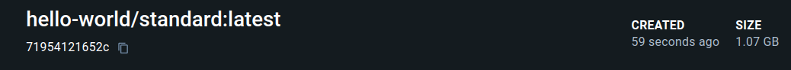
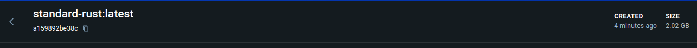
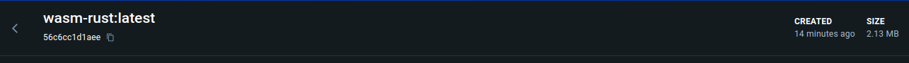

# TFG Viabilily research

This repository contains the necessary files to test the viability of using WebAssembly as a runtime for code. This example uses Rust as the programming language and the WebAssembly runtime using as an example the famous Hello World program.

## Index

- [TFG Viabilily research](#tfg-viabilily-research)
  - [Index](#index)
  - [Components](#components)
    - [CASE A: Standard Rust container](#case-a-standard-rust-container)
    - [CASE B: Rust container version alpine](#case-b-rust-container-version-alpine)
    - [CASE C. WebAssembly container](#case-c-webassembly-container)
  - [Build](#build)
    - [CASE A](#case-a)
    - [CASE B](#case-b)
    - [CASE C](#case-c)
  - [Memory size](#memory-size)
    - [CASE A](#case-a-1)
    - [CASE B](#case-b-1)
    - [CASE C](#case-c-1)

## Components

### CASE A: Standard Rust container

Contains the standard Rust environment with the necessary tools to compile and run Rust code.

### CASE B: Rust container version alpine

Contains the Rust environment with the necessary tools to compile and run Rust code, but with the alpine version of the container.

### CASE C. WebAssembly container

Container with the WebAssembly runtime, based on scratch, to run the compiled WebAssembly code.

## Build

Build times for each case are shown below.

### CASE A

`1 minute and 15 seconds`

### CASE B

`1 minute and 04 seconds`

### CASE C

`12,9 seconds`

> [!NOTE]  
> All this times and cases have been taken from the same machine and the same conditions. The only difference is the container used. All build have been done with the same code, with no cache and pull always the latest image.

> [!WARNING]
> The build times may vary depending on the machine and the conditions of the build, e.g connection speed.

## Memory size

Memory size for each case are shown below.

### CASE A

`2,02 GB`

### CASE B

`1,07 GB`

### CASE C

`2,13 MB`

## Container Start and execution time

Container start and execution time for each case are shown below.

### CASE A

TO-Do

### CASE B

TO-DO

### CASE C

TO-DO

docker run --runtime io.containerd.wasmedge.v1 --name rust-wasm --platform wasi/wasm wasm-rust:latest