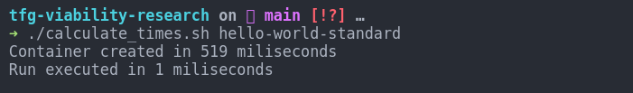
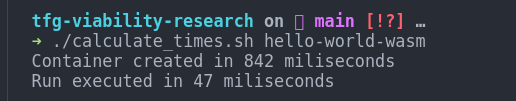

# TFG Viabilily research

This repository contains the necessary files to test the viability of using WebAssembly as a runtime for code. This example uses Rust as the programming language and the WebAssembly runtime using as an example the famous Hello World program.

## Index

- [TFG Viabilily research](#tfg-viabilily-research)
  - [Index](#index)
  - [Test cases](#test-cases)
    - [Hello World](#hello-world)
    - [Warp API](#warp-api)
  - [Methodology](#methodology)

  

## Test cases

For this research, two test cases have been implemented. The first one is a simple Hello World program and the second one is a simple API using the Warp library.

### Hello World

The Hello World program is a simple program that prints the message "Hello, World!" to the console. This program is implemented in Rust and compiled to WebAssembly.

### Warp API

The Warp API is a simple API that listens on the port 8080 and returns a JSON object with the message "Hello, World!".

```
Hello from Warp!
```

## Methodology

The methodology used is to measure two key parameters of using WebAssembly as a runtime for code. The first parameter is the size of the image generated, and the second parameter is the time it takes to the container to be ready (from nothing to ready to serve requests), and the time it takes to complete the action (in this case, return the message "Hello, World!, or a response of the API).

The test are performed in three scenarios:

- Docker container without WebAssembly (using the standard image in each folder)
- Docker Container with WebAssembly (using the wasm image in each folder)
- Using Spin (a tool to run WebAssembly code)

## Results

### Hello World

The results of the Hello World program are the following:

#### Docker container without WebAssembly

- Image size: 1.38 GB


- Time to be ready: 519 ms
- Time to complete the action: 1 ms



#### Docker container with WebAssembly

- Image size: 2,46 MB


- Time to be ready: 842 ms
- Time to complete the action: 47 ms



#### Using Spin

- Time to start: 306 miliseconds (estimate due to manual stop, it's actually less)

```bash
Serving http://127.0.0.1:3000
Available Routes:
  spin: http://127.0.0.1:3000 (wildcard)
spin up  0,06s user 0,09s system 47% cpu 0,306 total
```


